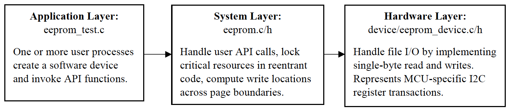

# MTDD
### Multi-Tiered Device Driver Implementation

Bad firmware is unforgiving.
Based on my experience interfacing with hardware drivers of various flavors, I decided to create my own implementation of an *ideal* driver design.

Some Specs:

* 64Kb EEPROM internally organized as 8192 bytes
* 32-byte page access
* Byte erase state is 0xFF
* Desired API: `eeprom_[read/write](uint32_t offset, int size, char *buf)`

**Design**:

I decided to build this EEPROM driver with a multi-tier design pattern that takes advantage of hardware abstraction by separating the user actions from the hardware interface. This design consists of an application (`eeprom_test.c`), system (`eeprom.c`), and hardware (`eeprom_device.c`) layer. The application layer consists of potentially multiple reader/writer processes. The system layer contains reentrant code that must protect the hardware resource from contention. The hardware layer contains platform-specific hardware code (ie. file I/O) and in a typical system would also contain register definitions. In order to use the driver, a user simply needs to write application code by including the API provided in `eeprom.h`.



For this project, I decided to improve upon the provided API with the following considerations:

* Make the driver reusable across EEPROM models: The specifications provided are an example of one EEPROM model’s capabilities. However, I designed this driver such that the system layer is platform-independent. This was achieved through the use of a generic device struct `eeprom_dev_t` which contains a properties type `eeprom_dev_properties_t` that the user must fill in with device specifications prior to driver operation. Alternatively, this struct could be filled with device descriptors stored in the MCU.
* Make the driver portable across hardware: Because of the three-layer design pattern, the system layer is only responsible for page boundary calculations and only sees the public interface to the hardware provided by `eeprom_device.h`. Therefore, if hardware were to be swapped out, only the hardware layer needs to be refactored.
* Graceful error handling - the user should be provided the ability to handle faults and exceptions: this was achieved through the use of a callback function that the user must provide the device struct in the application layer. This is invoked whenever a fault occurs in the system layer.

**Using the Driver**:

In order to use the driver, the user should follow the following steps:

1. Include the header file `eeprom.h`
2. Instantiate a properties struct `eeprom_dev_properties_t` and provide at minmum:
a. base_address: base EEPROM memory address
b. device_size_words: total number of possible write/read locations
c. page_size_bytes: bytes per page
3. Allocate memory for a device struct `eeprom_dev_t` and fill in the following fields: a. mutex: reference to global mutex shared between processes
b. properties: reference to `eeprom_dev_properties_t` struct above
c. fault_handler: pointer to callback error handler function with string argument
4. When calling `eeprom_[write/read](dev, offset, size, buf)`, provide the above device struct as the first argument.

**Assumptions**:
_Application Layer_:
* Buffer size matches the size argument input.
* User has access to a device datasheet and knows beforehand the possible range of indexable addresses needed to fill in a properties struct.
_System Layer_:
* Channel is able to transmit or receive only one byte at a time (based on I2C specification).
* Data is stored in big-endian format.
* Writes are page-bounded, but reads are not.
* Offsets from base address are positive.
_Hardware Layer_:
* Writes and reads are single-byte aligned.
* Continuous address space.
* A logger would exist on a real system, but I used printfs instead.

**Design Summary**:

Once the user satisfies the API specifications described above, the system will respond to API calls as follows:

_eeprom.c_:

Page write calculations: For reads, page boundaries are ignored as in typical systems. However, for writes, I’ve taken an approach in which page boundaries are considered and writes are broken up in to multiple transactions based on the pages that must be crossed. Write transactions across page boundaries would violate the EEPROM write capability, however, data could still be represented as a stream across boundaries. Consider an example where pages are 32-bytes wide, but the user wants to write a size 42-byte buffer starting at offset 28. This is depicted as:
```
0                               32                               64                               96
|--------------------------------|--------------------------------|--------------------------------|------------
                            |----|--------------------------------|------|
                            28                                           70
```                            
In this example, three pages must be written across two page boundaries. Therefore, I calculate that three writes must occur. The first write is 4-bytes, the second is 32-bytes, and the third is 6-bytes.

Resource contention: At first, I considered declaring a singleton device struct in the header `eeprom_tx.h` that multiple processes would access, but I figured this type of design pattern would overcomplicate my code. Instead, I opted for a global device mutex that must be declared by the user and handed to each process’s device struct. This global mutex is passed into the read/write functions in each process. The system layer contains reentrant code that must handle simultaneous read/write requests using this global mutex. Before a critical section of code is reached (ie. requests to hardware layer for reads/writes), the device mutex is locked so that only one process may access it at a time. If a failure or success occurs, the mutex is unlocked for another process to resume operation.

Hardware faults: The device struct is assumed at this point to contain a function pointer (callback) to a fault handler. Therefore, if there is a hardware fault, this callback is invoked with a descriptive message for the user such that they may handle errors. In the provided test module, I simply exit the application when a fault occurs. While I typically don’t like function pointers, this seemed the most obvious way of satisfying my API functionality of letting the user have their own fault handler.

_eeprom\_device.c_:

File I/O: For this system, I represent the EEPOM device as a data file called `eeprom.dat`. I designed this such that each word in memory is given its own line terminated by a new-line character. This made debugging the file much easier as it is highly readable.
File writes: Writing to files in c is harder than it appears. In order to overwrite a specific line in the `eeprom.dat` file whenever a write was requested, I first had to construct a temporary file, iterate through the current file, replace the specified line of data with the new byte, then rename the temporary file such that it becomes the new `eeprom.dat`.
File reads: This was simpler as it just required I iterate through the existing `eeprom.dat` and increment a counter whenever I read out a 3 character string until reaching the desired line (3 is apparently the number of chars to represent one byte on one line of a file).
Hardware logging: Instead of logging errors to the system, I print out any “hardware” errors to the terminal.

**Coding Standards Used**:

* Doxygen comments
* PIMPL function naming convention
* Public API restricted to header files
* errno.h for standadrd error codes
* Vim text editor
* gcc compiler

**Testing the Driver**:

To test the driver, run the “make” command from within the eeprom_driver directory. This will automatically run the compiled eeprom_test executable. To run the test program separately, simply run ```./eprom_test```. This program goes through several representative test cases including:

1. Write and read within one (the first) page
2. Write and read across one page boundary
3. Write and read across multiple page boundaries
4. Write and read at EEPROM boundary
a. *There is a section of code that may be commented out in this test case to show how the fault handler is invoked when a write/read outside of the available device memory occurs.*
5. Bad user input. Here the device struct is uninitialized and the program is supposed to fail.
6. Multiple processes contending for the hardware resource. Here, there are four processes – two writers and two readers – that attempt to transact on the same exact memory locations at once. Here, the use of a device mutex is critical.

**Future Design Considerations**:

* For this project, I did not consider adding API functionality for erasing pages or the erasing the full memory, however this is an extremely simple augmentation atop my current design. This would involve page-by-page writes of 0xFF.
* The current read/write functionality is blocking. In the future, I would make these functions non-blocking and implement a callback function for asynchronous writes/reads so user can decide how to handle operation completions outside of a main thread.
* In the future, I would make a device descriptor file so that the user doesn’t have to specify device specs every time they want to perform a read or write. This would involve storing model-specific attributes in a separate file and simply referencing the name of a particular device when creating a driver instance. I would also make a create function in the system layer to accept a device descriptor. The user would then hand the create function a device descriptor.
* On a typical hardware-interfacing system, there would likely need to be timing requirements for reads/writes so that the MCU doesn’t attempt to do multiple back-to-back transactions without allowing the EEPOM to ‘respond’. I would therefore include some form of process sleeping between page reads/writes.

**References**:

* http://hillside.net/plop/2006/Papers/Library/PLoP-Article_1_v6.pdf
* http://www.virtsync.com/c-error-codes-include-errno
